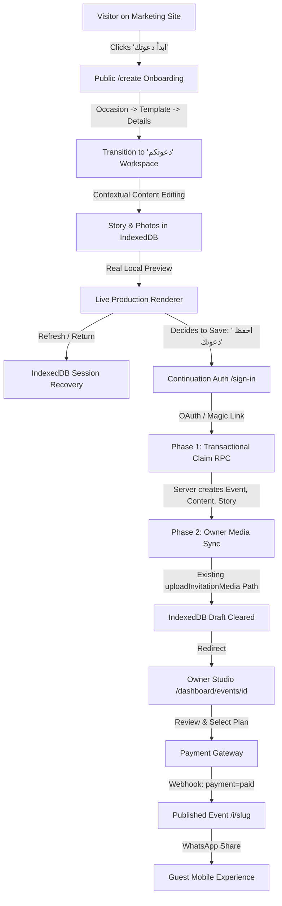

# LAMMA — Master Product Architecture & Experience Specification
**Document Version:** 1.2.0  
**Status:** Authoritative Specification (Final Consistency Pass Baseline)  
**Target Market:** Digital Invitations Platform — Weddings First (Weddings, Engagements, Katb Ketab), Multi-Occasion Core  
**Enforcement:** Architectural & Conceptual Reference — Specification Only (No Code or Migration Changes)

---

## 1. Executive Product Model

LAMMA is a premium self-service digital invitation platform engineered to transform digital invitations from disposable static links into memorable, emotionally resonant mobile experiences.

```
┌─────────────────────────────────────────────────────────────────────────────────────────┐
│                                    LAMMA PLATFORM                                       │
├────────────────────────┬──────────────────────────────┬─────────────────────────────────┤
│       COMMERCIAL       │          EXPERIENCE          │            LIFECYCLE            │
│  Free Build & Preview  │    Curated Template Engine   │   Guest-First Local Draft (IDB) │
│  One-Time Pay-to-Publish│   Scene-Based Choreography   │   Idempotent Claim Transaction  │
│  2 Technical Plans     │   Mobile-First Art Direction │   Two-Phase Owner Media Sync    │
│  + Made-For-You Service│   Dual-Language Interface    │   WhatsApp Link Distribution    │
└────────────────────────┴──────────────────────────────┴─────────────────────────────────┘
```

### 1.1 Core Positioning
LAMMA is **NOT** a generic website builder (like Wix or WordPress).  
LAMMA is **NOT** a free-form drag-and-drop canvas (like Canva).  
LAMMA is **NOT** a configurable stack of arbitrary web widgets.

The user must never feel like they are configuring software or debugging a webpage layout. The guiding principle is:
> **"اختر التجربة. اكتب حكايتكم. ولمّة تصنع الدعوة."**  
> *"Choose the experience. Tell your story. LAMMA builds the invitation."*

### 1.2 Market & Occasion Architecture
While the primary commercial launch focuses on Arab wedding events (**Weddings / زفاف**, **Engagements / خطوبة**, **Katb Ketab / كتب كتاب**), the platform is architected as an **Occasion-Agnostic Event Engine**. A single unified architecture supports:
- Weddings, Engagements, Katb Ketab, Anniversaries
- Birthdays, Baby Showers, Graduations
- Private Gatherings, Ramadan Iftar / Sohour
- Corporate & Bespoke Celebrations

No separate applications, parallel codebases, or branched repos will be maintained for different occasions.

### 1.3 Architectural Reference Points
- **Zeekraa** (*Commercial Reference*): Rich visual presentation, commercial clarity, self-contained interactive invitation features (music, countdown, gallery, RSVP, wishes).
- **Wedvitation** (*Frictionless Reference*): Clean self-service funnel: browse designs → personalize → preview → one-time payment to publish.
- **Makarious & Sarah** (*Quality Benchmark*): Authored sequence of emotional scenes, tactile reveal, deliberate pacing, cinematic typography, and mobile-first interactions.
- **Eterna** (*Brand Polish*): Elevated contemporary luxury presentation devoid of generic SaaS cliches.

### 1.4 Truthful Marketing & Capability Stance
LAMMA marketing and product copy must represent only tested, implemented capabilities:
- No fabricated customer reviews, artificial couple testimonials, or synthetic satisfaction percentages.
- Development fixtures and mock outputs must never be presented to customers as evidence of live AI capabilities.
- Live public demos must run the identical runtime renderer used by customer invitations.

---

## 2. Product Principles & Philosophy

### 2.1 Emotional Architecture & Product Voice
1. **The Guest Reaction**: When a guest opens a LAMMA link on WhatsApp, the response must be: *"إيه ده؟ عملتوها إزاي؟"* (*"What is this? How did you make this?"*).
2. **The Host Pride**: The host must feel genuine pride sending their invitation to family and friends.
3. **Authentic Arabic-First Voice**: The application speaks natural, warm, celebratory Egyptian Arabic (with working English localization for bilingual couples):
   - *"مش مجرد دعوة. دي بداية المناسبة."*
   - *"فرحك بيبدأ قبل يومه."*
   - *"أول انطباع عن فرحكم يبدأ من هنا."*
   - Human, natural action verbs: `ابدأ دعوتك` (not `قم بإنشاء السجل`), `اختار التصميم` (not `تهيئة القالب`), `ضيفوا صوركم` (not `إدارة وسائط المعرض`).
4. **Language-Agnostic Content**: The product UI is fully localized (Arabic / English), while invitation content entered by the user (names, text, story) remains single-entry and language-agnostic.

### 2.2 Product Separation Matrix
To prevent architectural drift, the platform enforces strict conceptual separation across all layers:

| Layer | Question Answered | Responsibility | Governed By |
|---|---|---|---|
| **Plan** | *What can I publish?* | Package quotas, premium template eligibility, interaction modules. | Capabilities / Entitlements Registry |
| **Template** | *How does it feel?* | Scene sequence, opening ritual, visual pacing, motion profile, layout composition. | Template Blueprint Registry |
| **Sections** | *What is included?* | Active modules (Location, Story, Gallery, Music, RSVP, Wishes). | Section Registry & Owner Visibility |
| **Content** | *What does it say?* | Names, dates, venue text, story milestones, photos, quotes, audio tracks. | Normalized Database Tables |
| **Personal Touch** | *What is my accent?* | Safe, optional template-supported personal touches (under *"لمستكم"*). | Template Blueprint Settings |
| **Lifecycle** | *Where does it live?* | Distinct orthogonal states: publication, payment, claiming/sync, and preview UI. | State Lifecycle Model (§2.3) |

### 2.3 Orthogonal State Lifecycle Model
System states must never be conflated or crammed into a single enum like `events.status`. The platform maintains four independent state axes:

```
┌────────────────────────────────────────────────────────────────────────────────────────┐
│                                FOUR ORTHOGONAL STATE AXES                               │
├────────────────────────────────┬───────────────────────────────────────────────────────┤
│ 1. Publication Status          │ draft | published | archived                           │
│    (Database: events.status)   │ Controls public availability at /i/[slug]             │
├────────────────────────────────┼───────────────────────────────────────────────────────┤
│ 2. Payment Status              │ unpaid | paid | refunded                               │
│    (Database: events.payment)  │ Gates commercial transition to 'published'            │
├────────────────────────────────┼───────────────────────────────────────────────────────┤
│ 3. Draft / Claiming State      │ local_draft | claiming_db | syncing_media | synced    │
│    (Client/Session ephemeral)  │ Progress of unauthenticated draft handoff             │
├────────────────────────────────┼───────────────────────────────────────────────────────┤
│ 4. Preview Viewport State      │ mobile (390px) | desktop | fullscreen                 │
│    (Client UI purely)          │ Responsive studio rendering toggle                    │
└────────────────────────────────┴───────────────────────────────────────────────────────┘
```

---

## 3. End-to-End User Journeys



### 3.1 Unauthenticated Guest-First Journey
1. **Entry & Lightweight Onboarding**:
   - Visitor clicks `"ابدأ دعوتك"` on `/` and lands on `/create`.
   - Complete absence of an authentication wall.
   - User experiences a lightweight, friendly onboarding sequence:
     `إيه المناسبة؟` (Occasion) → `اختار التصميم` (Template) → `الأسماء والتاريخ` (Names & Date).
2. **Transition to Unified "دعوتكم" Workspace**:
   - Crucially, `/create` does **not** trap the user in a throwaway multi-page form wizard.
   - It transitions immediately into the **SAME simplified "دعوتكم" mental model** intended for the permanent Studio.
   - User sees the contextual sidebar with their real preview alongside it.
3. **Local IndexedDB Persistence**:
   - Client initializes a lightweight IndexedDB draft record (`client_draft_id: UUID`, `schema_version: 1`).
   - Photos selected by the user are stored locally as `Blob`s in IndexedDB.
   - Ephemeral object URLs (`URL.createObjectURL(blob)`) render immediately inside the live preview.
4. **Local Persistence Notice**:
   - UI displays clear, reassuring copy:  
     *`"مسودة محفوظة محلياً على هذا المتصفح. احفظ حسابك لضمان عدم ضياعها."`*
5. **Same-Origin Refresh**:
   - If the user reloads `/create`, IndexedDB rehydrates the draft and regenerates object URLs seamlessly.
6. **Continuation Trigger**:
   - User clicks `"احفظ دعوتك ومتابعة"` to preserve their invitation in a permanent account.

### 3.2 Authenticated Continuation & Two-Phase Claiming
1. **Constrained Navigation**:
   - The user is routed to `/sign-in?continuation=claim-draft`.
   - **CRITICAL SECURITY RULE**: Invitation content, photo blobs, and tokens are **never** passed via query parameters or OAuth state.
   - All draft data remains safely buffered in client IndexedDB.
2. **Authentication**:
   - User completes Google OAuth or Magic Link sign-in.
3. **Phase 1 (Database Transaction)**:
   - Client invokes the Server Action `claimGuestDraft(client_draft_id, draftPayload)`.
   - The server derives `owner_id = auth.uid()` securely from session cookies (never trusted from client payload).
   - Validates all fields against the schema.
   - Executes an atomic PostgreSQL transaction (via a dedicated RPC) that inserts:
     - `public.events` (storing `client_draft_id` for idempotency)
     - `public.event_content`
     - `public.event_experience`
     - `public.event_sections`
     - `public.event_story_items`
   - If a record with `client_draft_id` already exists for this user, the existing event is returned without duplicating rows.
4. **Phase 2 (Resumable Media Synchronization via Existing Owner Pipeline)**:
   - Following successful Phase 1, the client receives the newly minted `event_id`.
   - Client sequentially uploads buffered photo `Blob`s from IndexedDB using the **existing owner-authorized media pipeline** (`uploadInvitationMedia` / `event_media` boundary).
   - Reuses existing validation: MIME magic bytes, 5MB file size limit, media limits, owner authentication, safe path construction (`${user.id}/${event.id}/${randomUUID()}.${extension}`), and position ordering.
   - Local photo IDs map to cloud media results for resumable sync.
5. **Cleanup**:
   - Only after Phase 1 and Phase 2 successfully complete is the local IndexedDB draft cleared.
6. **Failure Safety**:
   - If authentication is cancelled or fails, the user is redirected back to `/create` with their IndexedDB draft and photos 100% intact.

### 3.3 Public Guest Experience
1. Guest receives a clean link on WhatsApp (`/i/ahmed-and-salma-2026`).
2. Opens link on mobile browser.
3. Template-governed opening sequence welcomes the guest (see §5.2 for opening strategies).
4. Audio begins playing smoothly if configured and unlocked by guest interaction (strictly autoplay compliant).
5. Guest navigates through the curated scene sequence: formal invitation, date countdown (to start of event day), photo moments, narrative story chapters, venue details with map navigation, wishes guestbook, and attendance RSVP.
6. Guest submits congratulations and RSVP without needing an account.
7. Closing scene leaves a lasting celebratory impression.

### 3.4 "Made For You" (Concierge Service) Journey
1. Host visits landing page concierge section: *"تحب نعملهالك بنفسنا؟ فريق لمّة في خدمتك."*
2. Host clicks *"تواصل معنا عبر WhatsApp"*.
3. Concierge collects event details, photos, and preferences over WhatsApp.
4. Concierge configures the invitation in an administrative console using an existing Premium package.
5. Host receives private preview link, requests revisions, completes payment, and receives ownership.

---

## 4. Commercial Plans & Capability Engine

### 4.1 Two Technical Plans + One Service Layer
The platform operates on **two technical plans** in the database engine, with *Made For You* offered as an operational concierge service:

```
┌────────────────────────────────────────────────────────────────────────────────────────┐
│                                   COMMERCIAL MODEL                                     │
├────────────────────────────┬───────────────────────────┬───────────────────────────────┤
│     ESSENTIAL (أساسي)      │      PREMIUM (الذهبي)     │    MADE FOR YOU (صنعناها لك)  │
├────────────────────────────┼───────────────────────────┼───────────────────────────────┤
│ Technical Plan: essential  │ Technical Plan: premium   │ Technical Plan: premium       │
│ Self-service standard tier │ Self-service full feature │ Service layer + Premium plan  │
│ One-time payment per event │ One-time payment per event│ One-time service fee          │
└────────────────────────────┴───────────────────────────┴───────────────────────────────┘
```

### 4.2 Entitlement Capability Registry
Plan names must **never** be hardcoded into feature conditionals (e.g., `if (plan === "premium")`). Features check fine-grained capabilities:

```typescript
export type CapabilityKey =
  | "template.premium"
  | "gallery.limit"
  | "story.limit"
  | "quotes.enabled"
  | "music.enabled"
  | "wishes.enabled"
  | "wishes.limit"
  | "rsvp.enabled"
  | "branding.watermark";

export type CapabilityValue = boolean | number;

export type PlanDefinition = {
  id: "essential" | "premium";
  name: { ar: string; en: string };
  priceEgp: number;
  capabilities: Record<CapabilityKey, CapabilityValue>;
};
```

### 4.3 Proposed Commercial Limits vs. Local Preview Safety Limits
*Critical Principle: Technical local-preview limits are distinct from commercial publishing entitlements. The platform encourages generous experimentation before payment.*

| Capability | Local Preview Safety Limit | Essential (أساسي) Entitlement | Premium (الذهبي) Entitlement | Made For You (Service) |
|---|---|---|---|---|
| **Technical Plan** | `essential` (preview mode) | `essential` | `premium` | `premium` (+ concierge) |
| **Commercial Model** | Free experimentation | One-time / event | One-time / event | One-time service + plan |
| **Publishing to `/i/[slug]`**| ❌ Disabled (Preview only)| ✅ Live Public Link | ✅ Live Public Link | ✅ Live Public Link |
| **Launch Templates** | Full local preview | Eligible launch set (≥1) | All Launch Templates | All Launch Templates |
| **Photo Moments (Gallery)**| Up to 15 photos (safe preview)| Up to 5 photos (proposed) | Up to 15 photos (proposed) | Up to 15 photos + curation |
| **Story Chapters** | Up to 8 chapters (safe preview)| Up to 3 chapters (proposed)| Up to 8 chapters (proposed)| Up to 8 chapters + editing |
| **Date Countdown** | Local preview | Included | Included | Included |
| **Location & Maps** | Local preview | Included | Included | Included |
| **Quotes Section** | Local preview | Included | Included | Included |
| **Background Music** | Local preview (curated) | ❌ Disabled | ✅ Curated library | ✅ Curated library |
| **Guest Wishes** | Local preview (disabled)| ❌ Disabled | ✅ Included (Moderated) | ✅ Included (Moderated) |
| **RSVP System** | Local preview (disabled)| ❌ Disabled | ✅ Included (Private) | ✅ Included (Private) |
| **Lamma Watermark** | Present | Subtle footer | Discreet | Removed |
| **Service Support** | Community / Help docs | Email support | Priority Email | Dedicated WhatsApp Agent |

### 4.4 Capability Enforcement Rules
1. **Server-Side Gatekeeping**: Capabilities must be verified inside Server Actions and database constraints before publishing or saving records. UI locks alone are visual indicators, not security boundaries.
2. **Generous Preview**: Users are permitted to configure and preview supported features locally up to the preview safety ceiling so they experience the full emotional value before purchasing.
3. **Payment Gating**: Payment gates the transition from `status: 'draft'` to `status: 'published'`. Unpaid events cannot be accessed via public `/i/[slug]` routes.
4. **Data Retention & Link Duration**: Link active duration (e.g., 6 months vs 1 year post-event) and long-term media retention policies remain an open operational decision (§18). Lifetime hosting is **never** promised.

---

## 5. Template Blueprint Architecture

### 5.1 Why Template != Skin
A skin only alters colors and CSS variables. A **Template Blueprint** dictates the entire mobile experience:
- Opening ritual and entrance motion.
- Section narrative sequence and visual cadence.
- Typographic scale, hierarchy, and atmospheric styling.
- Responsive mobile/desktop art direction.
- Closing scene emotional framing.

### 5.2 Opening Strategy Is Governed by the Template
The opening scene is **not always a locked cover**. The Template Blueprint owns its opening strategy according to its creative tone:
- **Explicit Tap-to-Open**: Tactile envelope, stationery cover, or wax seal reveal (ideal for dramatic audio synchronization).
- **Soft Reveal**: Gentle scroll-triggered curtain or archway fade.
- **Immediate Cinematic Introduction**: Direct hero title entrance with atmospheric pacing.

*Rule: Templates without audio must not be artificially forced behind an opening gate solely for architectural uniformity.*

### 5.3 Template Blueprint Contract
Templates are hardcoded, typed React/CSS blueprints registered in code under stable string identifiers. Neither users nor AI can inject arbitrary HTML or scripts:

```typescript
export type TemplateBlueprint = {
  id: string; // e.g. "cinematic-wedding-story"
  name: { ar: string; en: string };
  description: { ar: string; en: string };
  planEligibility: "essential" | "premium";
  supportedOccasions: readonly string[];
  structure: {
    openingStrategy: "tap-to-open" | "soft-reveal" | "immediate-cinematic";
    openingScene: React.ComponentType<SceneProps>;
    sceneSequence: readonly SectionId[];
    requiredSections: readonly SectionId[];
    closingScene: React.ComponentType<SceneProps>;
  };
  supportedPersonalization?: {
    allowsAccentColor?: boolean;
    allowsHeadingScale?: boolean;
  };
};
```

### 5.4 Launch Template Strategy
The platform targets **three production launch templates**, with at least one eligible for the Essential plan:

| Template Slot | Identifier / Reference | Plan Tier | Visual Direction Status | Key Characteristics |
|---|---|---|---|---|
| **Template 1** | `cinematic-wedding-story` *(existing)* | **Essential** | Provisional (baseline) | Editorial elegance, balanced ivory/black tones, classic typography. |
| **Template 2** | `midnight-luxury` *(provisional)* | **Premium** | Provisional (needs review) | Moody nocturne, emerald/obsidian tones, high-contrast typography. |
| **Template 3** | `warm-boho` *(provisional)* | **Premium** | Provisional (needs review) | Soft terracotta, arched framing, airy whitespace, joyful warmth. |

*Design Rule: Specific artistic styling, ornamentation, and template marketing names are provisional and subject to rendered visual prototype review. Existing identifiers (`cinematic-wedding-story`) must not be renamed or broken.*

### 5.5 Content Preservation Principle
Switching between templates in the Studio alters the layout and presentation blueprint, but **never silently erases, truncates, or reorders existing user content** (names, dates, story chapters, or uploaded photos).

---

## 6. Authoritative Section Registry & Persistence Mapping

### 6.1 Distinction: Product Labels vs. Internal Persistence Keys
To prevent architectural drift, the platform maintains a strict distinction between **Owner-Facing Product Labels** and **Internal Schema Keys**:

```
Owner-Facing Label: "اختار التصميم"   ──► Internal Key: template_id / experience_key
Owner-Facing Label: "المكان والخريطة" ──► Internal Key: events.venue_name, events.location_url
Owner-Facing Label: "قصتنا"          ──► Internal Key: story / public.event_story_items
Owner-Facing Label: "الصور"          ──► Internal Key: gallery / public.event_media
Owner-Facing Label: "كلمة من ضيوفكم"  ──► Internal Key: guestbook / public.event_wishes
```

Existing persistence identifiers must **never** be renamed or refactored just to match marketing copy.

### 6.2 Capability-to-Persistence Mapping Table (Current Actual Schema)
The following table reflects the **exact, verified schema** implemented in the repository:

| User-Facing Capability | Owner Product Label | Actual Persisted Columns | Actual Database Table | Architectural Rule |
|---|---|---|---|---|
| **`opening`** | شاشة الدخول | None (rendered via template) | Template Component | Structural scene; not a DB row. |
| **`invitation`** | نص الدعوة والأسماء | `headline`, `invitation_text`, `host_names`<br>`title`, `event_date` | `public.event_content`<br>`public.events` | Core invitation narrative. |
| **`location`** | المكان والخريطة | `venue_name`, `location_url` | `public.events` | In `events` table; optional while drafting. |
| **`countdown`** | العد التنازلي | `event_date` (date-only) | `public.events` | Targets 00:00 local start of event day (§6.4). |
| **`story`** | قصتنا | `title`, `body`, `date_label`, `position` | `public.event_story_items` | Normalized rows; integer ordering. |
| **`gallery`** | الصور | `storage_path`, `alt_text`, `position` | `public.event_media` | Private storage + server-only signing (Task 011B). |
| **`quotes`** | اقتباس مميز | Future field in `event_content` | `public.event_content` | Stored in content to prevent join overhead. |
| **`wishes`** | كلمة من ضيوفكم | Section key: `'guestbook'` | `public.event_sections` & future `public.event_wishes` | Reuses existing `guestbook` section identifier. |
| **`rsvp`** | تأكيد الحضور | Section key: `'rsvp'` | `public.event_sections` & future `public.event_rsvp` | Private response tracking; not exposed publicly. |
| **`music`** | الموسيقى الخلفية | `theme_config.audio_track_id` | `public.event_experience` | Experience-level property; no separate table. |
| **`closing`** | الختام والشكر | None (rendered via template) | Template Component | Structural scene; uses `host_names`. |

### 6.3 Venue & Map Location Policy
- Location details are **optional** during initial drafting and building.
- `location_url` in `public.events` accepts any standard map URL (Google Maps, Apple Maps, or general navigation links).
- URL format validation ensures well-formed links, but the platform makes **no claim of verifying physical geographic accuracy**.

### 6.4 Countdown Semantics & Event Time Stance
- The existing schema stores `events.event_date` as a `date` (e.g., `2026-10-15`).
- **Countdown Semantics**: The live countdown strictly targets the **start of the event day (00:00 local time)**.
- The platform will **not invent arbitrary times** (e.g., assuming 18:00 or 20:00).
- Explicit ceremony start time (`time without time zone`) and venue timezone (`text`) are documented for a future dedicated schema migration (§15).

---

## 7. Simplified Owner Builder UX

### 7.1 The "دعوتكم" (Our Invitation) Mental Model
The existing 3-tab layout (`المحتوى`, `التصميم`, `الأقسام`) fragments the creative process. The Studio interface presents a unified contextual drawer layout:

```
┌────────────────────────────────────────────────────────────────────────────────────────┐
│                             STUDIO INTERFACE (DESKTOP)                                 │
├─────────────────────────────────────────┬──────────────────────────────────────────────┤
│               DRAWER IA                 │                 LIVE PREVIEW                 │
│                                         │                                              │
│  ▼ دعوتكم (حفل زفاف أحمد وسلمى)        │   ┌──────────────────────────────────────┐   │
│                                         │   │                                      │   │
│  1. اختار التصميم                       │   │                                      │   │
│  2. البيانات الأساسية (الأسماء والتاريخ)│   │           [PHONE VIEWPORT]           │   │
│  3. تفاصيل الحفل والمكان               │   │                                      │   │
│  4. قصتنا                               │   │       Synchronized Real Render       │   │
│  5. الصور                               │   │        of Template Blueprint         │   │
│  6. اقتباس مميز                         │   │                                      │   │
│  7. الموسيقى الخلفية                   │   │                                      │   │
│  8. كلمة من ضيوفكم (Wishes)             │   │                                      │   │
│  9. تأكيد الحضور (RSVP)                 │   │                                      │   │
│                                         │   └──────────────────────────────────────┘   │
│  [ نشر الدعوة وترقية الباقة ]           │   (Preview Toggle: Mobile / Full Screen)     │
└─────────────────────────────────────────┴──────────────────────────────────────────────┘
```

### 7.2 Unified Editing Principles
1. **Linear Contextual Flow**: `اختار التصميم` → `البيانات الأساسية` → `المحتوى والتفاصيل` → `إظهار / إخفاء الأقسام` → `المعاينة` → `الحفظ والنشر`.
2. **Template Selection is Primary**: `اختار التصميم` focuses exclusively on selecting the Template Blueprint. Optional safe personalization (if supported by the template) is presented as a secondary option under *"لمستكم"*. The old palette selector, typography selector, and variant selector are **not** primary creation steps.
3. **Zero Field Duplication**: Couple names and venue details are configured once in *البيانات الأساسية* (`events.title`, `events.venue_name`, `events.location_url`) and automatically flow to the Cover, Invitation Text, and Closing scenes.
4. **Timezone Simplicity**: Defaults automatically to the user's browser local timezone (e.g., `Africa/Cairo`). Advanced timezone selection is hidden behind an optional secondary toggle.
5. **Accessible Reordering**: Photos and story chapters use clear, accessible **Up/Down arrow buttons** paired with integer position inputs. Drag-and-drop is **not** a mandatory V1 requirement.
6. **Section Visibility**: Optional sections (Story, Gallery, Quotes, Music, Wishes, RSVP) feature a single, high-contrast toggle switch:
   - `ظاهر في الدعوة [إخفاء]`
   - `مخفي من الدعوة [إظهار]`

---

## 8. Guest-First Draft & Continuation Auth Architecture

### 8.1 Client IndexedDB Draft Storage Specification
To support real photo selection, previewing, and reordering before sign-in without unauthenticated server uploads, the client-side draft contract maps 1:1 to the actual production schema:

```typescript
export interface LocalDraftPhoto {
  id: string; // client-generated UUID
  blob: Blob; // local image Blob
  previewUrl: string; // ephemeral URL.createObjectURL(blob)
  altText: string | null;
  position: number;
}

export interface LocalGuestDraft {
  client_draft_id: string; // UUID v4
  schema_version: 1;
  created_at: number;
  updated_at: number;
  occasion: string;
  template_id: string;
  personalization?: {
    // optional template-supported personalization settings
    [key: string]: unknown;
  };
  event: {
    title: string;
    event_date: string; // YYYY-MM-DD
    venue_name?: string;
    location_url?: string;
  };
  content: {
    headline?: string;
    invitation_text?: string;
    host_names?: string;
  };
  story_items: Array<{
    title: string;
    body: string;
    date_label?: string;
    position: number;
  }>;
  photos: LocalDraftPhoto[];
}
```

### 8.2 IndexedDB Technical Rules
1. **Ephemeral Object URLs**: Object URLs are generated at runtime via `URL.createObjectURL(photo.blob)`. They are **never** persisted to IndexedDB or localStorage. When the session is restored or refreshed, object URLs are regenerated from stored `Blob`s.
2. **No Base64 in LocalStorage**: Binary photo data must never be encoded as base64 or stored in `localStorage` due to browser quota limits (typically 5MB).
3. **Single Active Draft**: In V1, exactly one active draft is maintained per browser origin (`store: "lamma_guest_draft"`).
4. **Storage Quota & Fallback Handling**:
   - Total draft media is monitored against available storage (`navigator.storage.estimate()`).
   - If quota is exceeded or IndexedDB is disabled (private browsing restrictions), the UI presents a friendly alert:  
     *`"المساحة المحلية ممتلئة. يمكنك حفظ الدعوة بحسابك أولاً ثم متابعة إضافة الصور."`*
   - Textual draft fields gracefully fall back to `localStorage` if IndexedDB is unavailable.
5. **Clear Copy & Expectations**:
   - Studio header displays: *`"مسودة محفوظة محلياً على هذا المتصفح"`*.
   - Tooltips state clearly: *`"الصور محفوظة على جهازك الحالي فقط. لن تظهر على أجهزة أخرى إلا بعد إنشاء الحساب."`*
6. **No Anonymous Server Footprint**: Zero anonymous database rows and zero unauthenticated Storage bucket uploads.

### 8.3 Two-Phase Claiming & Idempotent Sync
When the user clicks `"احفظ دعوتك"`:

```
[Client /create]
   │
   ├─► Step 1: Navigates to /sign-in?continuation=claim-draft
   │   (No sensitive payload in query params or OAuth state)
   │
[User Signs In via Google / Magic Link]
   │
[Redirected to /create?claimed=pending]
   │
   ├─► Step 2: Phase 1 — Server Action 'claimGuestDraft'
   │   │   Reads auth.uid() securely from session
   │   │   Calls PostgreSQL Transactional RPC
   │   │   Checks 'client_draft_id' idempotency
   │   │   Creates events, content, experience, sections, story
   │   └─► Returns { success: true, event_id: "..." }
   │
   ├─► Step 3: Phase 2 — Sequential Owner Media Sync (Reusing Existing Pipeline)
   │   │   Client reads photo Blobs from IndexedDB
   │   │   Calls existing uploadInvitationMedia action per photo
   │   │   Uses private invitation-media bucket (${user.id}/${event.id}/${uuid}.${ext})
   │   │   Creates event_media rows via owner RLS
   │   └─► Confirms all photos uploaded
   │
   ├─► Step 4: Clear Local IndexedDB Draft
   │
   └─► Step 5: Redirect to /dashboard/events/[event_id]
```

### 8.4 AI Cost & Quota Boundaries
- Manual guest creation at `/create` **does not require or invoke paid AI**.
- Unauthenticated visitors are **never** granted access to live generative AI models.
- Existing authenticated AI quota boundaries are strictly retained.
- Any future anonymous AI trial requires a formal abuse prevention, rate-limiting, and budget allocation decision.

---

## 9. Feature Specifications & Stakeholder Decision Resolutions

### 9.1 Background Music — RESOLVED DECISION
- **Strategy**: Start with a small, curated library of licensed celebratory and ambient instrumental tracks for launch.
- **Copyright Stance**: Licensing terms and permitted uses must be formally documented prior to public commercial release. Claims of "zero copyright liability" are revoked.
- **Custom Uploads**: User audio uploads are **deferred** beyond V1 to prevent copyright infringement, storage abuse, and mobile playback codec failures.
- **Playback Rule**: Autoplay without interaction is prohibited by modern browsers. Playback initializes **strictly upon valid guest interaction** (e.g., tapping the reveal button in an opening scene). A floating, discreet player widget allows pausing/resuming at any time.

### 9.2 Guest Wishes (كلمة من ضيوفكم) — RESOLVED DECISION
- **Moderation Default**: Submitted wishes are received by the host, but **public display requires host approval by default** (`status: 'pending'`).
- **Data Model**:
  ```sql
  create table public.event_wishes (
    id uuid primary key default gen_random_uuid(),
    event_id uuid not null references public.events(id) on delete cascade,
    guest_name text not null check (char_length(guest_name) between 2 and 80),
    message text not null check (char_length(message) between 2 and 500),
    status text not null default 'pending' check (status in ('pending', 'approved', 'hidden')),
    created_at timestamptz not null default now()
  );
  ```
- **Security & Abuse**: Rate limiting is handled at the **server/edge API boundary** (Next.js server action / edge middleware) to enforce client frequency caps. The narrow database RPC `submit_event_wish(p_slug, p_guest_name, p_message)` is responsible for parameter validation and insertion.
- **Owner Controls**: Host dashboard provides one-click `قبول` (Approve), `إخفاء` (Hide), and `حذف` (Delete) actions.

### 9.3 RSVP System (تأكيد الحضور) — RESOLVED DECISION
- **Phone Number Requirement**: Phone number is **optional and disabled by default**. Hosts may enable it as an optional field in the Studio.
- **Privacy Rule**: Guest RSVP responses are **strictly private to the host** and are never exposed via the public invitation projection.
- **Data Model**:
  ```sql
  create table public.event_rsvp (
    id uuid primary key default gen_random_uuid(),
    event_id uuid not null references public.events(id) on delete cascade,
    guest_name text not null check (char_length(guest_name) between 2 and 100),
    attending boolean not null,
    guest_count integer not null default 1 check (guest_count between 1 and 10),
    phone_number text check (char_length(phone_number) <= 25),
    dietary_notes text check (char_length(dietary_notes) <= 300),
    created_at timestamptz not null default now(),
    updated_at timestamptz not null default now()
  );
  ```
- **Write Boundary**: Dedicated narrow RPC `submit_event_rsvp(p_slug, p_guest_name, p_attending, p_count, p_phone, p_notes)` with rate limiting enforced at the edge/server boundary.
- **Host Dashboard**: Headcount summary cards (Attending, Declining, Total Guests) with instant CSV export.

### 9.4 Stable Link Slugs — RESOLVED DECISION
- **Strategy**: Readable, stable generated links (e.g., `/i/ahmed-and-salma-2026`) are provided across **all V1 plans** (Essential and Premium).
- **Vanity Slugs**: Custom vanity slug editing and related upselling are **deferred** beyond V1 to prevent slug squatting and URL routing conflicts.

### 9.5 Gallery & Private Media Architecture
- **Storage Bucket**: Private `invitation-media`.
- **Access Control**: Authenticated owner RLS policies for mutations.
- **Server Signer**: `src/features/invitations/server/published-media.ts` guarded by `import "server-only"`.
- **Projection RPC**: `public.get_published_invitation_media(p_slug)` granted exclusively to `service_role`.
- **Browser Model**: Sanitized `{ url, altText, position }`. Raw storage paths are never delivered to the client.

---

## 10. Public Guest Experience

### 10.1 Choreographed Scene Narrative
1. **The Opening**: Template-governed opening sequence (tap-to-open, soft reveal, or immediate introduction). Audio begins smoothly if configured and unlocked by guest interaction.
2. **The Announcement**: Grand reveal of couple names and celebration headline.
3. **The Formal Words**: Traditional greeting and heartfelt invitation text.
4. **The Anticipation (Countdown)**: Live calendar countdown targeting 00:00 of the event day.
5. **The Memories (Gallery)**: Curated photo moments presented in the template's signature responsive layout.
6. **The Story (Milestones)**: Narrative milestones charting the journey.
7. **The Destination (Venue)**: Venue title, address description, and direct maps button.
8. **The Participation (Wishes & RSVP)**: Streamlined, accessible engagement cards.
9. **The Closing**: Parting sentiment and warm family gratitude.

### 10.2 Technical Performance Standards
- **Mobile First**: Optimized specifically for iOS Safari and Android Chrome viewport dimensions.
- **Media Optimization**: Images served via Supabase CDN image transforms (`width: 1280, quality: 80, format: webp`).
- **Audio Efficiency**: Audio file preloaded only after user opening interaction; zero impact on initial page weight.
- **Pure Web Standards**: HTML, React, Vanilla CSS. No heavy external 3D runtimes or layout-blocking scripts.

---

## 11. Marketing Website Architecture

### 11.1 Information Architecture & Truthful Positioning
The marketing site establishes aesthetic luxury and consumer trust without misleading claims:

```
/ (Homepage)
├── /templates (Live interactive template showcase)
├── /pricing (Transparent Essential vs. Premium breakdown)
├── /how-it-works (3-step creation walk-through)
├── /made-for-you (Concierge VIP service information)
└── /faq (Comprehensive answers on payments, WhatsApp sharing, links)
```

### 11.2 Homepage Narrative Structure
1. **Hero**: Celebratory headline, live interactive mobile phone demo, and primary CTA `"ابدأ دعوتك مجانًا"`.
2. **Live Interactive Showcase**: Interactive preview allowing visitors to toggle between launch templates using real invitation data.
3. **The 3-Step Journey**:
   - `1. اختار التجربة`: Choose a design that reflects your celebration.
   - `2. اكتب حكايتكم`: Add your words, memories, and venue in minutes.
   - `3. شارك الفرحة`: Send a single, elegant link over WhatsApp.
4. **Comparison Matrix**: Physical paper printing vs. LAMMA digital experience.
5. **Feature Highlights**: Real demonstrations of Photo Moments, Music, Wishes, and RSVP.
6. **Pricing Clarity**: Clear breakdown of Essential (أساسي) vs. Premium (الذهبي) with Made For You concierge option.
7. **Customer FAQ**: Answering common questions on payment methods, guest privacy, and WhatsApp compatibility.
8. **Closing Invitation**: Direct link to `/create`.

---

## 12. Frontend Visual Direction & Localization

### 12.1 Aesthetic Foundations
- **Contemporary Luxury**: Modern minimalist editorial layouts fused with authentic Middle Eastern warmth.
- **Palette Tokens (Provisional)**:
  - Obsidian Base: `#121413`
  - Warm Alabaster: `#FAF8F5`
  - Celebratory Terracotta: `#C96242`
  - Subtle Gold Leaf: `#C5A880`
  - Tactile Linen: `#EAE5DF`

### 12.2 Typography Hierarchy
- **Arabic Display**: *Alexandria* and *Amiri* for formal titles and monograms.
- **Arabic Body**: *Readex Pro* and *IBM Plex Sans Arabic* for effortless mobile reading.
- **Latin Display**: *Playfair Display* and *Outfit* for bilingual pairings.

### 12.3 Dual-Language Architecture
- Studio UI and Marketing Site provide complete Arabic and English string bundles.
- Conversational Arabic is written in natural, polished Egyptian Arabic.
- User-authored invitation text remains single-entry and language-agnostic.

---

## 13. Security, Data Integrity & Capability Enforcement

### 13.1 Security Boundaries
1. **Private Media**: Zero anonymous `SELECT` or `INSERT` policies on the `invitation-media` Storage bucket.
2. **Server Signing**: All public image URLs are short-lived signed tokens (30 minutes) generated on the server.
3. **Restricted RPCs**: Media projections and admin actions are granted exclusively to `service_role`.
4. **Row-Level Security**: Owners can modify only records where `owner_id = auth.uid()`.
5. **Narrow Guest RPCs & Edge Rate Limiting**: Public interactions (`submit_event_wish`, `submit_event_rsvp`) pass through strictly typed functions with parameter sanitization and edge frequency limiting.
6. **Isolated Payments**: All payments are verified via server-side webhook signatures.

### 13.2 Data Retention & Link Duration Policy
- **Open Decision**: The platform will define an explicit retention policy (e.g., live link guaranteed for 12 months post-event, followed by an archival read-only period).
- **Commercial Honesty**: LAMMA will not promise permanent "lifetime" cloud hosting for a one-time fee.

---

## 14. Existing Codebase Audit & Status Matrix

To eliminate confusion, implementation status is categorized across four distinct states:
1. **Code Exists**: Implementation files present in repository.
2. **Migration Confirmed Applied**: Database schema verified in active Supabase instance.
3. **Runtime Verified**: Feature tested end-to-end in owner studio and public guest renderer.
4. **Production-Ready**: Fully hardened, audited, and ready for commercial traffic.

| Module / Component | Current Implementation Path | Code Exists | Migration Applied | Runtime Verified | Production Ready | Architectural Reality & Status Notes |
|---|---|:---:|:---:|:---:|:---:|---|
| **Supabase Auth** | `src/lib/supabase/proxy.ts`, `/sign-in` | ✅ Yes | ✅ Yes | ✅ Yes | ⚠️ Partial | Retain session cookies; support `?continuation=claim-draft`. |
| **Events Schema** | `public.events` | ✅ Yes | ✅ Yes | ✅ Yes | ⚠️ Partial | Contains `venue_name`, `location_url`, `timezone`. Add `client_draft_id`. |
| **Event Content** | `public.event_content` | ✅ Yes | ✅ Yes | ✅ Yes | ✅ Yes | Contains `headline`, `invitation_text`, `host_names`. Normalized. |
| **Event Experience** | `public.event_experience` | ✅ Yes | ✅ Yes | ✅ Yes | ⚠️ Partial | Stores `experience_key` and `theme_config`. Connect to Template Registry. |
| **Event Sections** | `public.event_sections` | ✅ Yes | ✅ Yes | ✅ Yes | ⚠️ Partial | Retain toggles; reuse `guestbook` section key for Wishes. |
| **Media Bucket & RPC** | `event_media`, `20260903160000_...sql` | ✅ Yes | ⚠️ **Observed in DB** | ❌ Unverified | ⚠️ Reconcile | **Database objects observed** (`event_media`, bucket, RLS, triggers, RPCs); final migration parity & grants require verification before any SQL operation. Do NOT rerun blindly. |
| **Media Server Signer**| `server/published-media.ts` | ✅ Yes | N/A | ❌ Unverified | ⚠️ Code Ready | Guarded with `server-only` and `service_role` key. Ready for runtime test. |
| **Story Items** | `public.event_story_items` | ✅ Yes | ✅ Yes | ✅ Yes | ✅ Yes | Contains `title`, `body`, `date_label`, `position`. Normalized. |
| **Countdown & Venue** | `InvitationRenderer` | ✅ Yes | ✅ Yes | ✅ Yes | ⚠️ Partial | Countdown targets 00:00 start of day; uses `events.venue_name`. |
| **Legacy Variants** | `theme_config.variant` | ✅ Yes | ✅ Yes | ✅ Yes | ⚠️ Legacy | Retain for backwards compatibility; hide from new creation. |
| **Cinematic Wedding** | `cinematic-wedding-story.tsx` | ✅ Yes | ✅ Yes | ✅ Yes | ⚠️ Partial | Formalize as Launch Template 1 blueprint. |
| **Builder UI** | `src/features/invitations/workspace.tsx`| ✅ Yes | N/A | ✅ Yes | ⚠️ Needs Redesign | Replace 3-tab layout with contextual *"دعوتكم"* drawers. |
| **Guest Flow** | `src/app/create/page.tsx` | ✅ Yes | N/A | ⚠️ Partial | ❌ Incomplete | Upgrade to IndexedDB with real Blob photos & unified Studio mental model. |
| **Marketing Site** | `src/app/page.tsx` | ✅ Yes | N/A | ⚠️ Basic | ❌ Incomplete | Build comprehensive consumer showcase. |

---

## 15. Database & Migration Roadmap

*Rule: No migrations are to be created or applied during this specification task.*

### Upcoming Migration Sequence
1. **Migration 1 (Reconciliation & Gallery Parity)**:
   - Verify parity of existing database objects against `20260903160000_create_event_media_and_public_gallery_projection.sql` (specifically `media_position` column alias and `service_role` grant). Apply only missing diffs.
2. **Migration 2 (Plan Association & Claim Idempotency)**:
   - Add `client_draft_id uuid unique` to `public.events`.
   - Add `plan_id text not null default 'essential'` and `payment_status text not null default 'unpaid'` to `public.events`.
   - Add transactional RPC `claim_guest_draft(...)` for Phase 1 handoff.
3. **Migration 3 (Interactive Modules: Wishes & RSVP)**:
   - Create `public.event_wishes` (with default `status = 'pending'`).
   - Create `public.event_rsvp` (phone optional, private to owner).
   - Create narrow write RPCs `submit_event_wish` and `submit_event_rsvp`.
4. **Migration 4 (Time Precision)**:
   - Add `event_time time without time zone` to `public.events` (note: `timezone` already exists in `public.events`).

---

## 16. Implementation Roadmap & Bounded First Slice

### 16.1 The Single Bounded Next Slice: Public Create Foundation
Before attempting full draft claiming or database migrations, the first development slice must be completely self-contained, client-verifiable, and free of backend writes:

```
┌────────────────────────────────────────────────────────────────────────────────────────┐
│                        BOUNDED IMPLEMENTATION SLICE 1                                  │
│                           Public Create Foundation                                     │
├────────────────────────────────────────────────────────────────────────────────────────┤
│  Scope:                                                                                │
│  1. Signed-out user flow:                                                              │
│     Home → /create                                                                     │
│     → Lightweight onboarding: occasion → choose Template → essential details           │
│     → Transition immediately into simplified "دعوتكم" workspace                        │
│     → Contextual Story / Gallery editing locally (with Blobs and ephemeral URLs)       │
│     → Live production Invitation Renderer preview                                      │
│     → IndexedDB session refresh recovery                                               │
│                                                                                        │
│  Absolute Constraints for Slice 1:                                                     │
│  - NO authentication required                                                          │
│  - NO Supabase database writes                                                         │
│  - NO Supabase Storage uploads                                                         │
│  - NO new feature schemas                                                              │
│  - NO payment integration                                                              │
│  - NO Wishes/RSVP/Music interactive backend                                            │
│                                                                                        │
│  Acceptance Tests for Slice 1:                                                         │
│  - [ ] Mobile viewport (390px) responsive layout works smoothly                        │
│  - [ ] Desktop viewport split layout works smoothly                                    │
│  - [ ] Working Arabic localization (natural Egyptian Arabic)                           │
│  - [ ] Working English localization                                                    │
│  - [ ] User can select, preview, and reorder real local photos within supported        │
│        preview safety limits (up to 15 photos) using Blobs & ephemeral object URLs     │
│  - [ ] Reordering photos and story chapters works via accessible Up/Down buttons       │
│  - [ ] Reloading browser completely restores draft text and local photo previews       │
│  - [ ] Switching templates maintains user content without data loss or reordering      │
│  - [ ] Completely replaces old Content/Design/Sections mental model with "دعوتكم"      │
│  - [ ] No old Variant/Palette selectors presented as primary steps                     │
│  - [ ] ZERO network requests to Supabase Storage or Database during /create            │
│  - [ ] Clear copy states: "مسودة محفوظة محلياً على هذا المتصفح"                       │
│  - [ ] Lint and build pass cleanly                                                     │
└────────────────────────────────────────────────────────────────────────────────────────┘
```

### 16.2 Subsequent Implementation Slices
- **Slice 2: Authenticated Claim & Media Sync**: Implementation of `/sign-in?continuation=claim-draft`, the transactional `claim_guest_draft` RPC, and sequential photo synchronization reusing the existing `uploadInvitationMedia` pipeline.
- **Slice 3: Simplified Drawer Studio**: Overhaul of `/dashboard/events/[id]` into the contextual *"دعوتكم"* drawer architecture.
- **Slice 4: Interactive Modules**: Wishes (moderated RPC), RSVP (private RPC), and Curated Music player.
- **Slice 5: Commercial Checkout & Publishing**: Payment gateway webhook, capability gatekeeper, and live `/i/[slug]` publishing.

---

## 17. Scope Boundaries (V1 Guardrails)

### MUST HAVE (V1 Core Release)
- Multi-occasion foundation (weddings, engagements, katb ketab prioritized).
- Unauthenticated guest-first creation on `/create` with IndexedDB local storage and photo previews.
- Two-phase transactional draft claim with database-backed idempotency.
- Two commercial plans (Essential, Premium) + Made For You assistance service.
- Three polished launch templates (with at least one eligible for Essential).
- Section Registry (Opening, Invitation, Location, Countdown, Story, Gallery, Quotes, Wishes, RSVP, Music, Closing).
- Moderated Wishes system (pending by default) and private RSVP tracking.
- Curated background music library (interaction-gated playback).
- Dual-language UI (Egyptian Arabic & English).
- Full consumer marketing website showcasing live invitations.

### NICE TO HAVE (Post-V1 Polish)
- Custom vanity domains (e.g., `ahmedandsalma.com`).
- Direct WhatsApp RSVP confirmation notifications.
- Interactive side-by-side bilingual display for mixed-nationality weddings.

### EXCLUDED FROM V1 (Hard Boundaries)
- Arbitrary drag-and-drop website builders or user-injected code.
- Interactive 3D table seating planners and venue floor charts.
- Individual guest-tracking CRM with distinct unique link tokens per guest.
- Video streaming, audio uploads, or guest video uploads.
- Native iOS/Android mobile apps.
- Payment pooling or gift registry management.

---

## 18. Stakeholder Decision Resolution Log & Open Policies

### 18.1 Resolved Review Decisions
1. **Local Draft Architecture**: IndexedDB with image `Blob`s and ephemeral `URL.createObjectURL(blob)`. No base64 in `localStorage`. Zero anonymous database or storage records.
2. **Claiming Transaction**: Server Action entry point calling a transactional PostgreSQL function. Enforces server-derived `owner_id = auth.uid()`. Database-backed idempotency via `client_draft_id`. Two-phase sync: DB transaction first, sequential media uploads second reusing `uploadInvitationMedia`.
3. **AI Boundaries**: No paid AI for unauthenticated guest flow. Retain authenticated AI quotas. No mock output marketed as production AI.
4. **Persistence Mapping**: Mapped to actual verified columns (`events.venue_name`, `events.location_url`, `event_story_items.title`, `body`, `date_label`, `position`). `wishes` reuses `guestbook` key. `opening`/`closing` handled in template component.
5. **Builder UX**: "دعوتكم" mental model. Contextual drawers. No duplicate fields. Accessible Up/Down ordering. Sensible local timezone default. Natural Egyptian Arabic + English localization.
6. **Template Strategy**: Three launch templates. Visual directions and names remain provisional. At least one template eligible for Essential. Existing keys (`cinematic-wedding-story`) preserved. Opening strategy is template-governed (not always locked cover).
7. **Plans & Entitlements**: Two technical plans (Essential, Premium). Made For You is a service layer. Local preview limits separated from commercial entitlements. Server-side capability gatekeeping.
8. **Background Music**: Curated library only; permitted use terms documented first; user uploads deferred; interaction-gated playback.
9. **Guest Wishes**: Public display requires host approval by default (`status: 'pending'`). Rate limiting at edge/server boundary.
10. **RSVP**: Phone number optional and disabled by default. Responses remain private to host.
11. **Slugs**: Stable generated readable slugs for all plans. Vanity slug editing deferred.
12. **Countdown**: Date-only countdown targets 00:00 local start of event day. Explicit time schema scheduled on roadmap.

### 18.2 Genuine Remaining Open Policies
The following two operational policies remain to be determined prior to commercial launch:
1. **Data Retention & Link Expiration Term**: Exact policy duration (e.g., live link accessible for 6 or 12 months after event date, followed by an archival read-only state).
2. **Music Licensing Agreement**: Formal commercial licensing terms for the 10 curated instrumental launch tracks.
